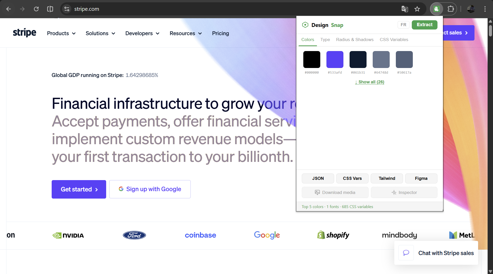
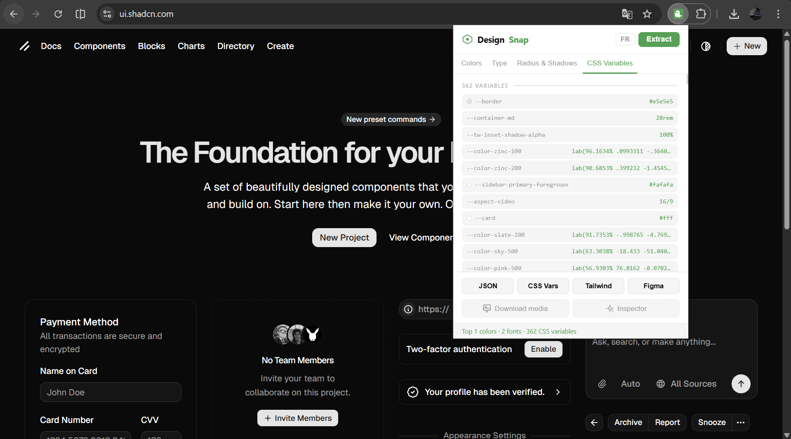
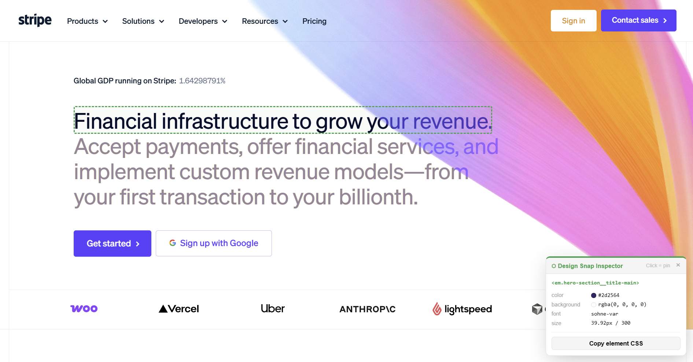
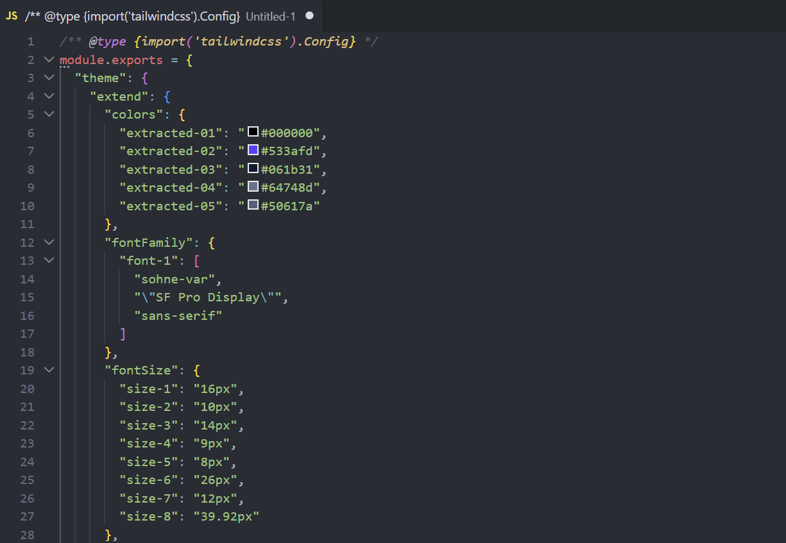

# Design Snap

**Extract design tokens, inspect elements, and download media from any website.**  
A Chrome extension built for designers and front-end developers who want to understand and reuse any site's design system — without digging through DevTools.

---

## Screenshots

| Colors | CSS Variables |
|--------|--------------|
|  |  |

| Element Inspector | Tailwind Export |
|------------------|----------------|
|  |  |

---

## Features

### 🎨 Design Token Extraction
Analyze any page and extract its core visual tokens:
- **Colors** — top colors ranked by usage frequency, with hex values
- **Typography** — font families (custom fonts only, generics filtered), sizes, weights, line-heights
- **Border radius** — unique values with visual preview
- **Box shadows** — unique values with live preview
- **CSS custom properties** — all `--variables` defined on `:root`

### 📤 Export in 4 Formats
Copy everything in one click, ready to paste into your project:

| Button | Output | Use case |
|---|---|---|
| **JSON** | Style Dictionary format | Design system token pipeline |
| **CSS Vars** | `:root { --token: value }` | Drop into any CSS/SCSS project |
| **Tailwind** | `tailwind.config.js` object | Paste into your Tailwind config |
| **Figma** | Tokens Studio JSON (`global` set) | Import into the Figma Tokens plugin |

### 🔍 Element Inspector
Hover any element on the page to see its computed styles in a floating panel:
- Element selector (`<div.hero>`)
- `color`, `background-color` with swatches
- `font-family`, `font-size`, `font-weight`
- `border-radius`, `box-shadow`
- **Copy CSS** button — copies a clean CSS block for the hovered element
- Click to **pin** an element, Échap to close

### 📥 Media Downloader
Click-to-download any image or video without right-clicking or digging through the network tab:
- Detects ``, `<video>`, CSS `background-image`
- **Choose folder once** — uses the [File System Access API](https://developer.mozilla.org/en-US/docs/Web/API/File System_Access_API) to write directly to any folder on your disk
- Downloads multiple files in a row without re-selecting the folder
- Auto-renames duplicates (`image.jpg` → `image-1.jpg`)
- Échap to exit the mode

---

## Installation

> No build step required — load directly from source.

### 1. Clone the repo

```bash
git clone https://github.com/your-username/design-snap.git
cd design-snap
```

### 2. Generate icons (first time only)

Run this in PowerShell from the project root:

```powershell
Add-Type -AssemblyName System.Drawing

function New-DesignSnapIcon($size, $path) {
    $bmp = New-Object System.Drawing.Bitmap($size, $size)
    $g   = [System.Drawing.Graphics]::FromImage($bmp)
    $g.SmoothingMode     = [System.Drawing.Drawing2D.SmoothingMode]::AntiAlias
    $g.TextRenderingHint = [System.Drawing.Text.TextRenderingHint]::AntiAliasGridFit
    $bg     = New-Object System.Drawing.SolidBrush([System.Drawing.Color]::White)
    $accent = New-Object System.Drawing.SolidBrush([System.Drawing.Color]::FromArgb(22, 163, 74))
    $white  = New-Object System.Drawing.SolidBrush([System.Drawing.Color]::White)
    $g.FillRectangle($bg, 0, 0, $size, $size)
    $m = [int]($size * 0.1)
    $g.FillEllipse($accent, $m, $m, $size - 2*$m, $size - 2*$m)
    $font = New-Object System.Drawing.Font("Arial", [float]($size * 0.42), [System.Drawing.FontStyle]::Bold)
    $sf   = New-Object System.Drawing.StringFormat
    $sf.Alignment = [System.Drawing.StringAlignment]::Center
    $sf.LineAlignment = [System.Drawing.StringAlignment]::Center
    $g.DrawString("D", $font, $white, (New-Object System.Drawing.RectangleF(0,0,$size,$size)), $sf)
    $bmp.Save($path, [System.Drawing.Imaging.ImageFormat]::Png)
    $g.Dispose(); $bmp.Dispose()
}

New-DesignSnapIcon 16  "icons\icon16.png"
New-DesignSnapIcon 48  "icons\icon48.png"
New-DesignSnapIcon 128 "icons\icon128.png"
```

> Or replace the files in `icons/` with your own 16×16, 48×48, and 128×128 PNG icons.

### 3. Load in Chrome

1. Open **`chrome://extensions/`**
2. Enable **Developer mode** (top-right toggle)
3. Click **"Load unpacked"**
4. Select the `design-snap/` folder
5. The Design Snap icon appears in your toolbar ✓

---

## Usage

### Extract tokens
1. Navigate to any website
2. Click the **Design Snap** icon
3. Click **Extraire**
4. Browse tabs: **Couleurs · Typo · Radius & Shadows · Variables CSS**
5. Click **↓ Voir tout** to expand beyond the top 5 colors
6. Click any swatch or token row to copy its value
7. Use the footer buttons to export everything: **JSON / CSS Vars / Tailwind / Figma**

### Inspect an element
1. Click **Inspecteur** in the popup
2. Hover any element — a floating panel shows its computed styles
3. Click an element to **pin** it (freezes the panel on that element)
4. Hit **Copier CSS** to copy a clean CSS snippet
5. Press **Échap** to close

### Download images & videos
1. Click **Télécharger média** in the popup
2. Optionally click **📁 Choisir le dossier** to pick a destination folder once
3. Hover images or videos — they highlight with a green outline
4. Click to download (saves directly to the chosen folder)
5. Download as many as you want — the mode stays active
6. Press **Échap** to exit

---

## Project Structure

```
design-snap/
├── manifest.json          # Chrome Manifest V3
├── background.js          # Service worker — handles chrome.downloads API
├── content/
│   └── content.js         # Injected into pages — extraction, inspector, downloader
├── popup/
│   ├── popup.html
│   ├── popup.css
│   └── popup.js
├── icons/
│   ├── icon16.png
│   ├── icon48.png
│   └── icon128.png
└── README.md
```

## Permissions

| Permission | Why |
|---|---|
| `activeTab` | Access the current tab when the user clicks the extension |
| `scripting` | Inject content script as fallback on already-open pages |
| `downloads` | Trigger file downloads via `chrome.downloads` |

---

## Tech Stack

- **Chrome Manifest V3** — service worker, content scripts, `chrome.scripting`
- **Vanilla JS** — zero dependencies, no framework, no bundler
- **File System Access API** — write files directly to any folder the user picks
- **`chrome.downloads`** — fallback downloader when CORS blocks fetch

---

## Roadmap

- [ ] Spacing tokens (margin, padding, gap)
- [ ] W3C Design Tokens format export
- [ ] Save & compare tokens between two sites
- [ ] Element hover history (last 5 inspected)

---

## Contributing

Pull requests are welcome. For major changes, open an issue first to discuss what you'd like to change.

1. Fork the repo
2. Create a branch: `git checkout -b feature/my-feature`
3. Make your changes (no build step needed — just edit the files)
4. Reload the extension in `chrome://extensions/` to test
5. Open a pull request

---

## License

[MIT](LICENSE)
